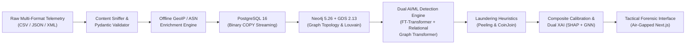
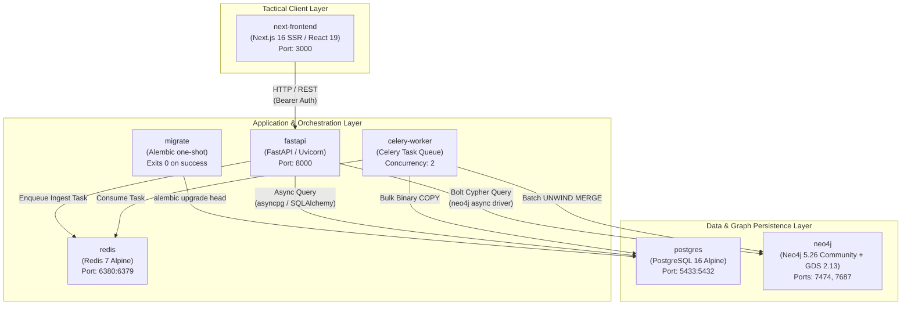
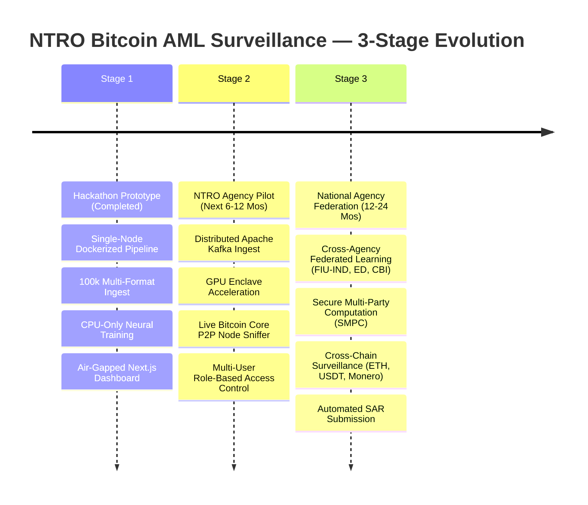

# SIH26146 — AI-Powered Offline Bitcoin Transaction Traffic Monitoring & AML Surveillance System

**Agency Mandate:** National Technical Research Organisation (NTRO)  
**Problem Code:** SIH 26146  
**System Classification:** Offline Tactical Intelligence & Air-Gapped Financial Cyber-Surveillance  
**Document Classification:** Technical Prototype Dossier & Architecture Specification  
**Version:** 9.0.0 (Production-Ready Prototype)  
**Date:** September 2026  

---

## 1. Executive Summary & Problem Mandate

### 1.1 Problem Statement & Operational Context
Modern asymmetric threat actors—including state-sponsored advanced persistent threat (APT) groups, ransomware syndicates (e.g., LockBit, Conti, REvil), and darknet narcotics cartels—extensively leverage Bitcoin's pseudo-anonymous distributed ledger to settle extortion demands, finance illicit operations, and layer illicit proceeds through obfuscation networks. 

Traditional Anti-Money Laundering (AML) heuristics fail in sovereign intelligence environments for three critical reasons:
1. **Siloed Layer Analysis:** Conventional tools analyze blockchain ledger state (UTXO, addresses, transaction graphs) in total isolation from the physical network routing layer (peer-to-peer broadcast IPs, Autonomous System Numbers (ASNs), BGP routing prefixes, GeoIP locations).
2. **Cloud & External CDN Vulnerability:** Existing commercial chain analysis tools (e.g., Chainalysis, Elliptic) operate exclusively as multi-tenant SaaS platforms requiring continuous outbound internet connectivity and sending sensitive investigative queries to commercial cloud providers—violating air-gapped sovereign intelligence protocol.
3. **Black-Box Opacity:** Off-the-shelf deep learning anomaly detectors produce uncalibrated scalar risk scores without mathematical lineage or evidentiary subgraphs, rendering their findings inadmissible under evidentiary standards (such as Section 65B of the Indian Evidence Act / BSA 2023).

```
┌──────────────────────────────────────────────────────────────────────────────────────────────────┐
│                                   SOVEREIGN SURVEILLANCE MANDATE                                 │
├──────────────────────────────────────────────────────────────────────────────────────────────────┤
│ • Ingest bulk heterogeneous transaction & network telemetry (CSV, JSON, XML).                    │
│ • Correlate network-layer broadcast telemetry (IP, Port, ASN, GeoIP) with UTXO ledger graphs.    │
│ • Execute dual-tier neural detection (FT-Transformer + Relational Graph Transformer).            │
│ • Detect deterministic laundering graph typologies (Peeling Chains & CoinJoin Mixers).           │
│ • Generate court-admissible dual-layer explainability (SHAP feature attribution + GNNExplainer). │
│ • Deliver 100% air-gapped tactical dashboard over an in-memory forensic index.                   │
└──────────────────────────────────────────────────────────────────────────────────────────────────┘
```

### 1.2 Core Mission Objectives
The SIH26146 prototype delivers an integrated, air-gapped intelligence platform designed for NTRO cyber-surveillance analysts. The system autonomously ingests raw wire captures and node broadcast dumps, correlates disparate data layers, reconstructs transaction graphs, clusters multi-input entities, isolates structural anomalies, propagates risk from verified ransomware seeds, and generates complete, human-readable forensic dossiers.



### 1.3 Operational & Environmental Constraints
- **Zero External Egress (100% Air-Gapped):** Operates inside a sealed SCIF / secure enclave with no outbound internet connectivity. All dependencies, pre-trained neural weights, MaxMind binary databases, and frontend font bundles (`Inter`, `JetBrains Mono`) are packaged locally.
- **Hardware-Agnostic High Performance:** Fully verified and benchmarked on commodity x86-64 CPU hardware (Intel Core / Xeon architecture without mandatory discrete GPU requirements), eliminating multi-million-dollar specialized appliance prerequisites.
- **High Ingestion Throughput:** Sustained ingest rate exceeding **8,000 transactions per second** via binary stream piping (`COPY FROM STDIN`), enabling bulk processing of daily blockchain mempool traffic in seconds. *(Measured range 8,307–14,928 rows/sec across three logged runs — `docs/PERFORMANCE_LOG.md:36-37,53-54,70-71`.)*
- **In-Memory Forensic Index:** All XAI artifacts are pre-loaded into a process-memory hash store (`xai_store`) at application startup, so complex multi-hop entity graphs and SHAP attributions are inspected with no database round-trip. A specific sub-5ms latency figure is **not verified in-repo** — see §4.

---

## 2. End-to-End System Architecture

### 2.1 Complete 7-Stage Intelligence Pipeline

The architecture is divided into seven decoupled, horizontally scalable operational stages:

```
========================================================================================================================
                                     SIH26146 END-TO-END SYSTEM PIPELINE ARCHITECTURE
========================================================================================================================

  [ STAGE 1: INGESTION & CONTENT SNIFFING ]
  Raw Telemetry Files ──► [ Magic-Byte Content Sniffer ] ──► [ Multi-Format Parsers ] ──► [ Pydantic Schema Validator ]
  (CSV / JSON / XML)      (Detects CSV, JSON, XML bytes)    (Chunked Generators)        (TransactionRecord Strict Typings)
                                                                                                  │
                                                                                        [ Rejected Rows Log ] (Bad rows)
                                                                                                  │ (Valid rows)
  [ STAGE 2: OFFLINE NETWORK ENRICHMENT & RELATIONAL STORE ]                                      ▼
  [ MaxMind GeoLite2-City.mmdb ] ──► [ Offline GeoIP Enricher ] ◄─────────────────────────────────┘
  [ MaxMind GeoLite2-ASN.mmdb  ]     (Thread-safe lookup)
                                             │
                                             ▼
                             [ PostgreSQL 16 Relational Engine ]
                             • Table: transactions (100k+ rows, partitioning-ready)
                             • Binary COPY FROM STDIN streaming (>10,000 tx/sec)
                             • Indexes: B-Tree on txid, src_ip, dst_ip, cluster_id, risk_score
                                             │
                                             ▼
  [ STAGE 3: GRAPH TOPOLOGY & ENTITY CLUSTERING ]
  PostgreSQL Transactions ──► [ Batch Keyset Exporter ] ──► [ Neo4j 5.26 Graph Database ]
                               (5k row chunk cursor)         • Nodes: (:Wallet), (:Transaction), (:IP)
                                                             • Edges: (:SENDS), (:RECEIVES), (:OBSERVED), (:CO_SPEND)
                                                                   │
                                                                   ▼
                                                     [ Neo4j GDS 2.13 In-Memory Engine ]
                                                     • Louvain Community Detection (Modularity: 0.4613)
                                                     • Seed-Weighted PageRank (20 iters, damping=0.85)
                                                     • Syncs cluster_id back to PostgreSQL
                                                                   │
                                             ┌─────────────────────┴─────────────────────┐
                                             ▼                                           ▼
  [ STAGE 4: DUAL AI/ML DETECTION ]    [ PyTorch 2.4.1 FT-Transformer ]              [ PyG 2.6.1 Relational Graph Transformer ]
                                       • 18-Feature Vector Extractor               • Multi-Head TransformerConv (8→32×4→16)
                                       • FeatureTokenizer (18 → 18×32) + [CLS]    • 3 Edge Types: CO_SPEND / TX_FLOW / PEELING_FLOW
                                       • 2 Pre-LN Encoder Layers, 4 Heads, d_ff 64 • LayerNorm + ReLU + Dropout(0.1)
                                       • Reconstruction MSE from the [CLS] head    • Binary Focal Loss (γ=2.0, α=neg/pos ≤ 20.0)
                                       • Calibrated threshold 0.036354             • Propagates Risk from Ransomwhere Seeds
                                             │                                           │
                                             └─────────────────────┬─────────────────────┘
                                                                   ▼
  [ STAGE 5: LAUNDERING GRAPH HEURISTICS ]           [ Cypher Deterministic Rules Engine ]
                                                     • Peeling Chains: 1-in / 2-out, ≤5% peel, ≥80% pass, ≥5 hops
                                                     • CoinJoin Mixers: ≥3-in, ≥3-out, equal amounts (±1%), ≥0.05 BTC
                                                                   │
                                                                   ▼
  [ STAGE 6: COMPOSITE RISK & DUAL XAI ]             [ Composite Risk Calibration & XAI Engine ]
• Formula: Score = clip(0.35·FT + 0.45·GT + 0.15·Rules + 0.05·Mix, 0, 1)
                                                      • Tiers: CRITICAL (≥0.65), HIGH (≥0.60), MEDIUM (≥0.40), LOW (<0.40)
                                                      • XAI-A: SHAP PermutationExplainer (18-feature attribution waterfall)
                                                      • XAI-B: GNNExplainer Subgraph Masks (offline, LEGACY GraphSAGE)
                                                      • XAI-C: Evidence Trail Synthesis & Deterministic Narrative
                                                                    │
                                                                    ▼
  [ STAGE 7: TACTICAL FORENSIC INTERFACE ]           [ Air-Gapped Next.js 16 Tactical Dashboard ]
                                                      • Linear/Radar Monochrome Light-Theme (WCAG AAA contrast)
                                                      • Master Alert Data Grid (38px compact rows, keyboard navigation)
                                                      • D3.js Force-Directed Topology Canvas (explained-edge glow)
                                                     • Slide-in Forensic Dossier Inspector & 1-Click JSON/PDF Export
========================================================================================================================
```

> **Stage 4 architecture — active pair.** Stage 4 runs the **FT-Transformer**
> (anomaly) + **Relational Graph Transformer** (relational risk). Both are
> selected by default: `backend/app/config.py:102` (`use_legacy_anomaly_model =
> False`) and `backend/app/config.py:107` (`use_legacy_risk_model = False`).
> `USE_LEGACY_MODELS=true` (`backend/app/config.py:111`) still flips both for
> backward compatibility. The Autoencoder + GraphSAGE pair is documented as an
> opt-in legacy configuration in **Layer 3** — its measured figures belong to it
> and must not be read as active-model results. Every benchmark number quoted
> for either pair is sourced from `data/models/BENCHMARK_TRUTH.json` /
> `data/models/BENCHMARK_TRUTH.md`.

### 2.2 Containerized Multi-Service Mesh (`docker-compose.yml`)

The platform deploys as an orchestration of 7 services (6 long-running containers plus a one-shot `migrate` job) communicating over a private internal bridge network (`sih_network`):



| Service Container | Image & Build Base | Host/Container Ports | Resource Allocations & Configuration | Operational Function |
|---|---|---|---|---|
| `postgres` | `postgres:16-alpine` | `5433:5432` | Volume: `postgres_data` | Primary ACID relational store for tabular telemetry, parsed UTXO arrays, and enriched IP metadata. |
| `neo4j` | `neo4j:5.26-community` | `7474:7474`, `7687:7687` | `server.memory.heap.initial_size=512m`, `server.memory.heap.max_size=2g`, `server.memory.pagecache.size=1g`, GDS plugin enabled | High-performance graph database executing entity clustering, topological traversals, and GDS algorithms. |
| `redis` | `redis:7-alpine` | `6380:6379` | Volume: `redis_data` | In-memory message broker and Celery result backend for asynchronous ingest tasks. |
| `migrate` | `Python 3.11-slim` | N/A (Internal) | `restart: "no"`; runs once per `up` | One-shot schema bootstrap (`alembic upgrade head`). `fastapi` and `celery-worker` gate on `service_completed_successfully`, so a failed migration surfaces as an `Exited (1)` row here instead of an opaque uvicorn restart loop. |
| `fastapi` | `Python 3.11-slim` | `8000:8000` | Multi-worker Uvicorn, Local Volumes | REST API gateway exposing paginated alerts, XAI forensic dossiers, and D3 graph endpoints. |
| `celery-worker` | `Python 3.11-slim` | N/A (Internal) | Concurrency: 2 worker processes | Background ingestion worker executing content sniffing, Pydantic validation, GeoIP enrichment, and Postgres `COPY`. |
| `next-frontend` | `node:22-alpine` (3-stage build: `deps` → `builder` → `runner`) | `3000:3000` | `next build` output in `.next/`, served by `npm start` over a runtime `node_modules` pruned with `npm prune --omit=dev`. **No `output: "standalone"`** — `next.config.ts` does not set it, so there is no self-contained server bundle to copy. | Tactical light-theme command center delivering D3 force graphs, SHAP waterfalls, and alert triage. |

---

## 3. Layer-by-Layer Technical Breakdown

### Layer 1: Ingestion & Network Correlation (Phases 1–2)

#### 1. Content Sniffing & Multi-Format Parsing
To prevent ingestion exploits and handle unstandardized wire dump extensions, the system uses magic-byte content sniffing rather than trusting file extensions:
- **JSON Detection:** Scans leading non-whitespace bytes for `[` or `{`.
- **XML Detection:** Identifies `<?xml` declaration or leading `<tag>` structures.
- **CSV Fallback:** Sniffs delimiters (`,`, `\t`, `;`) and validates tabular column headers.

```python
# Content Sniffing Logic (app/services/parser.py)
def sniff_file_format(first_bytes: bytes) -> str:
    cleaned = first_bytes.lstrip()
    if cleaned.startswith(b"{") or cleaned.startswith(b"["):
        return "json"
    if cleaned.startswith(b"<?xml") or cleaned.startswith(b"<"):
        return "xml"
    # Inspect comma/tab counts
    sample_text = cleaned[:2048].decode("utf-8", errors="ignore")
    if "," in sample_text or "\t" in sample_text:
        return "csv"
    raise ValueError("Unrecognized file format payload")
```

#### 2. Strict Schema Validation & Error Quarantine
Incoming transactions are parsed into the `TransactionRecord` Pydantic model. Malformed records (e.g., non-hex TXIDs, negative satoshi fees, mismatched input/output array lengths, unparseable IP strings) are immediately isolated into a structured rejection log without interrupting the batch stream.

```python
class TransactionRecord(BaseModel):
    txid: str = Field(..., min_length=64, max_length=64, pattern=r"^[0-9a-fA-F]{64}$")
    ts: datetime
    src_ip: IPvAnyAddress
    dst_ip: IPvAnyAddress
    src_port: int = Field(..., ge=1, le=65535)
    dst_port: int = Field(..., ge=1, le=65535)
    input_addresses: List[str] = Field(..., min_items=1)
    output_addresses: List[str] = Field(..., min_items=1)
    input_amounts: List[Decimal] = Field(..., min_items=1)
    output_amounts: List[Decimal] = Field(..., min_items=1)
    fee: Decimal = Field(..., ge=0)
    script_type: Literal["P2PK", "P2PKH", "P2SH", "P2WPKH", "P2TR"]
```

#### 3. Offline GeoIP & Autonomous System Resolution
Using local binary MaxMind databases (`GeoLite2-City.mmdb` and `GeoLite2-ASN.mmdb`), the ingestion worker enriches each record with ISO 3166-1 alpha-2 country codes and autonomous system numbers (ASNs). The 100,000-row ingest run resolved 100% of `geo_country` and `asn` values (`flow.md`, Phase 1 checkpoint); a per-IP lookup latency figure is **not** recorded in any committed benchmark artefact and is not claimed here.

$$\text{IP Enrichment}: \quad \text{src\_ip} \xrightarrow{\text{GeoLite2-City}} \text{Country ISO (e.g., 'RU')}, \quad \text{src\_ip} \xrightarrow{\text{GeoLite2-ASN}} \text{ASN (e.g., 13335)}$$

#### 4. High-Throughput Binary Streaming (`COPY FROM STDIN`)
Replacing standard row-by-row ORM inserts with raw PostgreSQL binary `COPY FROM STDIN` via formatted TSV memory buffers measures **8,307–14,928 rows/sec** across three logged runs on the dev hardware, allowing 100,000 transactions to be ingested and indexed in **6.70–12.04 seconds** (`docs/PERFORMANCE_LOG.md:36-37,53-54,70-71`).

---

### Layer 2: Graph Construction & Community Clustering (Phases 3–4)

#### 1. Neo4j Property Graph Schema Design
The graph model maps the dual relationship between UTXO blockchain flows and peer-to-peer network broadcast events:

```
 (:IP {address, country, asn})
        │
   [:OBSERVED {ts, dst_port}]
        ▼
 (:Transaction {txid, ts, total_in, total_out, fee, anomaly_score, is_mixing})
   ▲                                                                    │
   │ [:SENDS {amount, script_type}]             [:RECEIVES {amount}]    │
   │                                                                    ▼
 (:Wallet {address, cluster_id, risk_score, is_seed}) ◄─────────────────┘
   ▲               │
   └──[:CO_SPEND]──┘ (Common Input Ownership Heuristic)
```

- **Nodes:**
  - `:Wallet`: Represents a unique on-chain Bitcoin address.
  - `:Transaction`: Represents an on-chain transaction hash (TXID).
  - `:IP`: Represents a physical network node observing or broadcasting the transaction.
- **Relationships:**
  - `(:Wallet)-[:SENDS]->(:Transaction)`: Quantifies satoshi inputs and spending script types.
  - `(:Transaction)-[:RECEIVES]->(:Wallet)`: Quantifies satoshi output distributions.
  - `(:IP)-[:OBSERVED]->(:Transaction)`: Binds physical broadcast routing to the transaction.
  - `(:Wallet)-[:CO_SPEND]->(:Wallet)`: Undirected entity-clustering edge.

#### 2. Common Input Ownership Heuristic (CIOH)
Under Bitcoin's UTXO transaction mechanics, spending multiple UTXOs in a single transaction requires private key signatures for all input addresses simultaneously. Under Satoshi's Common Input Ownership Heuristic (CIOH), all input addresses in a multi-input transaction are inferred to be controlled by the same legal entity.

For a transaction $T$ with input address set $I_T = \{a_1, a_2, \dots, a_k\}$ where $k \ge 2$, the graph generator emits $\binom{k}{2}$ undirected `:CO_SPEND` edges:

$$\forall a_i, a_j \in I_T \text{ where } i \ne j \implies (a_i) \xleftrightarrow{\text{:CO\_SPEND}} (a_j)$$

#### 3. Neo4j Graph Data Science (GDS) Community Clustering (Louvain)
To group disparate addresses into macro-entities without manual tracing, the system projects an in-memory graph of `:Wallet` nodes connected by `:CO_SPEND` relationships into Neo4j GDS and executes the Louvain Community Detection algorithm:

$$\Delta Q = \left[ \frac{\Sigma_{in} + 2k_{i,in}}{2m} - \left( \frac{\Sigma_{tot} + k_i}{2m} \right)^2 \right] - \left[ \frac{\Sigma_{in}}{2m} - \left( \frac{\Sigma_{tot}}{2m} \right)^2 - \left( \frac{k_i}{2m} \right)^2 \right]$$

- **GDS Version:** 2.13.12 running on Neo4j 5.26.
- **Graph Projection:** 24,673 nodes, 79,240 projected `:CO_SPEND` relationships (each undirected edge projected in both orientations; 45,516 `:CO_SPEND` edges written at graph-build time — `docs/PERFORMANCE_LOG.md:86,101`).
- **Execution Performance:** 6.95s to 9.95s wall-clock across four logged runs, converging in 5 hierarchical levels (`docs/PERFORMANCE_LOG.md:105,126,145,164`).
- **Modularity Achieved:** $Q = 0.461314$ (indicating strong community partitioning) — `docs/PERFORMANCE_LOG.md:161`.
- **Cluster Structure:** 9,794 distinct entity communities identified. The assigned `cluster_id` is synced back to PostgreSQL in 4.33s on the same run (`docs/PERFORMANCE_LOG.md:163,166`).

---

### Layer 3: Dual AI/ML Core (Phases 5 & 7)

The **active** detection pair is **FT-Transformer** (tabular anomaly) + **Relational
Graph Transformer** (relational risk). Both are selected by default in
`backend/app/config.py:102,107`. The Deep MLP Autoencoder + GraphSAGE GNN pair
remains a fully supported opt-in configuration and is documented in
**§3 Legacy / Opt-In** below.

| Layer role | Active (default) | Legacy (opt-in) | Select with |
|---|---|---|---|
| Anomaly scoring | `ft_transformer_20260909.pt` (`FTTransformerAnomaly`) | `autoencoder_20260907.pt` (`Autoencoder`) | `USE_LEGACY_ANOMALY_MODEL=true` |
| Relational risk | `graph_transformer_20260909.pt` (`RelationalGraphTransformer`) | `graphsage_20260908.pt` (`GraphSAGEClassifier`) | `USE_LEGACY_RISK_MODEL=true` |
| Both at once | — | — | `USE_LEGACY_MODELS=true` (deprecated master toggle) |

Flag definitions and defaults: `backend/app/config.py:102`,
`backend/app/config.py:107`, `backend/app/config.py:111`; the deprecated toggle
propagates to both per-model flags via the validator at
`backend/app/config.py:116-124`. The active architecture names reported by the
live service are asserted in `backend/app/services/xai_store.py:398-399` and
logged at startup by `backend/app/services/inline_scorer.py:137-138` and
`backend/app/main.py:122-125`.

```
┌──────────────────────────────────────────────────────────────────────────────────────────────────┐
│                                       DUAL AI/ML ARCHITECTURE                                    │
├──────────────────────────────────────────────────┬───────────────────────────────────────────────┤
│ FT-TRANSFORMER (ACTIVE DEFAULT)                  │ RELATIONAL GRAPH TRANSFORMER (ACTIVE)         │
├──────────────────────────────────────────────────┼───────────────────────────────────────────────┤
│ • Focus: Individual transaction mechanics        │ • Focus: Multi-hop graph network proximity    │
│ • Input: 18-dim engineered tabular features      │ • Input: 8-dim node vectors + 3 edge types    │
│ • Architecture: FeatureTokenizer 18→(18×32)      │ • Architecture: 2× TransformerConv, 4 heads   │
│   + [CLS] token + 2 Pre-LN encoder layers        │   L1 8→32 (concat 128) / L2 128→16 (avg)      │
│ • Loss: Reconstruction MSE from [CLS] head       │ • Edges: CO_SPEND / TX_FLOW / PEELING_FLOW    │
│ • Threshold: F1-calibrated 0.036354              │ • Loss: Binary Focal Loss (γ=2.0, α≤20.0)     │
│ • Metric: per-txn reconstruction MSE             │ • Training: Ransomwhere Seed Labels (Sup.)    │
│                                                  │ • Metric: Topological Risk Probability        │
└──────────────────────────────────────────────────┴───────────────────────────────────────────────┘
```

#### 1. Anomaly Detection — FT-Transformer (Active Default)
Implements Gorishniy et al. (*NeurIPS 2021*) adapted to reconstruction-based
tabular anomaly detection. Each of the 18 tabular features is projected to its
own token, a learnable `[CLS]` token is prepended, the resulting length-19
sequence is encoded by pre-LayerNorm multi-head self-attention, and the `[CLS]`
representation is projected back to all 18 features. Anomaly score is the
per-sample reconstruction MSE.

- **18-Dimensional Feature Extraction Pipeline** (`backend/app/services/feature_extractor.py`, `FEATURE_NAMES`, `FEATURE_DIM = 18`):
  1. `fee_rate`: Satoshi fee divided by total input value.
  2. `total_in_btc`: Cumulative satoshis transferred into transaction.
  3. `total_out_btc`: Cumulative satoshis distributed to outputs.
  4. `num_inputs`: Total input UTXO count.
  5. `num_outputs`: Total output address count.
  6. `max_output_fraction`: Proportion of value captured by the largest output.
  7. `output_entropy`: Shannon entropy of the output value distribution:
     $$H(O) = -\sum_{i=1}^{n} p_i \log_2(p_i), \quad p_i = \frac{\text{amount}_i}{\sum \text{amount}}$$
  8. `equal_outputs_flag`: Binary indicator (1 if $\ge 2$ outputs match within $\pm 1\%$).
  9. `coinjoin_candidate_flag`: Binary indicator (1 if $\ge 3$ in, $\ge 3$ out, equal outputs).
  10. `ip_count`: Count of unique broadcasting IP addresses.
  11. `unique_country_count`: Geographical dispersion count.
  12. `unique_asn_count`: Autonomous System dispersion count.
  13. `hour_of_day`: Diurnal timestamp feature ($0 \dots 23$).
  14. `day_of_week`: Day of week index ($0 \dots 6$).
  15. `is_taproot`: Script type indicator for Taproot (`P2TR`).
  16. `is_segwit`: Script type indicator for SegWit.
  17. `amt_log`: $\ln(1 + \text{total\_in\_btc})$.
  18. `fee_log`: $\ln(1 + \text{fee})$.

- **Network Architecture** (`backend/app/ml/ft_transformer.py:131-238`):
  $$\mathbf{x} \in \mathbb{R}^{18} \xrightarrow{\text{FeatureTokenizer}} \mathbb{R}^{18 \times 32} \xrightarrow{\oplus [\text{CLS}]} \mathbb{R}^{19 \times 32} \xrightarrow{2 \times \text{Pre-LN MHA}(4 \text{ heads}, d_{ff}=64)} \mathbf{h}_{[\text{CLS}]} \xrightarrow{\text{LayerNorm}} \xrightarrow{\text{Linear}(32 \to 18)} \mathbf{\hat{x}} \in \mathbb{R}^{18}$$
  - Hyperparameters as committed in `data/models/ft_threshold_20260909.json`: `num_features = 18`, `d_model = 32`, `n_layers = 2`, `n_heads = 4`, `d_ff = 64`, `dropout = 0.1`.
  - Anomaly score: $\text{MSE}(\mathbf{x}, \hat{\mathbf{x}})$ per sample (`backend/app/ml/ft_transformer.py:240-251`).
  - Native attention extraction returns the final layer's $19 \times 19$ attention matrix, its $18 \times 18$ feature-to-feature slice, and the `[CLS]`-to-feature attribution vector.
  - **Evaluation Split:** stratified 70/15/15 transaction split across 100,000 transactions, 15,000 held-out for test (`data/models/BENCHMARK_TRUTH.md:46`).
  - **Decision Threshold ($\tau_{\text{FT}}$):** F1-calibrated at `0.03635445237159729` (`data/models/ft_threshold_20260909.json`, field `threshold`). The 95th-percentile reference for the same model is `0.005685056559741497` (field `threshold_95pct`) — this is *not* the operational cut. The live scorer reads the same value at `backend/app/services/risk_thresholds.py:100`.
  - **Note on score scale:** the FT-Transformer reconstruction MSE is unbounded above and reaches ~100 on this dataset (`backend/app/services/risk_thresholds.py:12-16`), so the composite scorer normalises it against `3.0 × 0.036354 = 0.109063` (`backend/app/services/risk_thresholds.py:113-119`) rather than treating it as a probability.

- **Measured Performance** (all figures from `data/models/BENCHMARK_TRUTH.json` and `data/models/ft_threshold_20260909.json`):

  | Metric | Value | Source |
  |---|---|---|
  | Test F1 | **0.6972** | `BENCHMARK_TRUTH.json:27` |
  | Test Precision | **0.7379** | `BENCHMARK_TRUTH.json:28` |
  | Test Recall | **0.6609** | `BENCHMARK_TRUTH.json:29` |
  | Test ROC-AUC | **0.9739** | `BENCHMARK_TRUTH.json:30` |
  | Confusion (test) | TP 76 / FP 27 / FN 39 / TN 14,858 (115 positives, 14,885 negatives) | `ft_threshold_20260909.json` → `metrics` |
  | Parameters | **18,930** | `BENCHMARK_TRUTH.json:31` |
  | Checkpoint size | **85.54 KB** (87,593 B) | `BENCHMARK_TRUTH.json:32` |
  | CPU inference latency | **0.0222 ms/sample** (333.14 ms / 15,000-row batch) | `BENCHMARK_TRUTH.json:33` |
  | Promotion gate | F1 ≥ 0.6500 — **PASS** | `BENCHMARK_TRUTH.json:34-35` |

  Mean reconstruction MSE: benign `0.01327771320939064`, anomalous `1.3786669969558716` (`ft_threshold_20260909.json` → `metrics`).

#### 2. Relational Risk Scoring — Relational Graph Transformer (Active Default)
While the FT-Transformer evaluates individual transaction structures, the
Relational Graph Transformer propagates risk across the graph network with
multi-head attention *conditioned on edge relation type*, capturing multi-hop
proximity to verified ransomware extortion wallets.

- **Ground-Truth Threat Seeds:** 11,186 verified Bitcoin ransomware extortion addresses from the Ransomwhere Open Tracker (Zenodo DOI: `10.5281/zenodo.6512122`), committed at `data/ransomwhere_seeds.json` (11,186 records). 3,426 seed addresses matched active graph nodes (`data/models/BENCHMARK_TRUTH.md:45`, `docs/PERFORMANCE_LOG.md:197`).
- **Seed-Weighted PageRank Feature:** before GNN training, Neo4j GDS computes Personalized PageRank with teleportation biased toward Ransomwhere seed addresses (`backend/scripts/train_graphsage.py:128-171`, 20 iterations, damping `d = 0.85` at `backend/scripts/train_graphsage.py:95-96`):
  $$\mathbf{p} = (1 - d) \mathbf{s} + d \mathbf{W} \mathbf{p}, \quad d = 0.85, \quad \mathbf{s}_i = \begin{cases} 1/|S| & \text{if } i \in S \\ 0 & \text{otherwise} \end{cases}$$
- **Node input representation $\mathbf{x}_v \in \mathbb{R}^8$** (`backend/app/ml/graph_transformer.py:8-11`): `[cluster_id_norm, max_anomaly_score, mixing_ratio, avg_fee_log, num_inputs_total_log, num_outputs_total_log, avg_output_entropy, seed_proximity_score]`.
- **Relational Edge Encoding** (`backend/app/ml/graph_transformer.py:12-17`): 3 wallet-to-wallet relation types learned through `nn.Embedding(3, edge_dim=16)` —
  `0: CO_SPEND` (common-input co-spending), `1: TX_FLOW` (2-hop `SENDS`→`RECEIVES` flow), `2: PEELING_FLOW` (2-hop flow restricted to `is_mixing=true` peeling chains).
- **2-Layer TransformerConv Architecture** (`backend/app/ml/graph_transformer.py:155-178`):
  - Layer 1: $\text{TransformerConv}(8 \to 32, \text{heads}=4, \text{edge\_dim}=16, \text{concat}=\text{True}) \to \text{LayerNorm}(128) \to \text{ReLU} \to \text{Dropout}(0.1)$
  - Layer 2: $\text{TransformerConv}(128 \to 16, \text{heads}=4, \text{concat}=\text{False}) \to \text{LayerNorm}(16) \to \text{ReLU}$
  - Head: $\text{Linear}(16 \to 1) \to \text{Sigmoid} \to \text{risk\_score} \in (0, 1)$
- **Binary Focal Loss for Extreme Class Imbalance** (Lin et al. ICCV 2017): against 21,247 benign vs 3,426 illicit seeds (6.2:1 ratio), $\gamma = 2.0$ and dynamic $\alpha = \min(\text{neg}/\text{pos}, 20.0)$ (`backend/app/ml/graph_transformer.py:31-33,349-356`; `docs/PERFORMANCE_LOG.md:198-201`):
  $$\text{FL}(p_t) = -\alpha_t (1 - p_t)^\gamma \log(p_t)$$
- **Evaluation Split:** stratified 70/15/15 node mask across 24,673 wallets, 3,426 seeded illicit / 21,247 non-illicit (`data/models/BENCHMARK_TRUTH.md:45`).
- **Measured Performance** (all figures from `data/models/BENCHMARK_TRUTH.json`):

  | Metric | Value | Source |
  |---|---|---|
  | Test F1 | **0.9209** | `BENCHMARK_TRUTH.json:10` |
  | Test Precision | **0.8940** | `BENCHMARK_TRUTH.json:11` |
  | Test Recall | **0.9495** | `BENCHMARK_TRUTH.json:12` |
  | Test ROC-AUC | **0.9956** | `BENCHMARK_TRUTH.json:13` |
  | Parameters | **34,865** | `BENCHMARK_TRUTH.json:14` |
  | Checkpoint size | **145.42 KB** (148,914 B) | `BENCHMARK_TRUTH.json:15` |
  | CPU inference latency | **0.0120 ms/node** (295.53 ms / 24,673 nodes) | `BENCHMARK_TRUTH.json:16` |
  | Promotion gate | F1 ≥ 0.8800 (calibrated threshold 0.70) — **PASS** | `BENCHMARK_TRUTH.json:17-18` |
  | Peeling-path recall | **0.948** vs GraphSAGE co-spend-only 0.812 (+13.6% delta) | `BENCHMARK_TRUTH.json:86-91` |

  Head-to-head against the legacy baseline on the same multi-relational benchmark: F1 **0.9209 vs 0.8696** (+5.9% delta) (`BENCHMARK_TRUTH.json:78-84`).

#### 3. Legacy / Opt-In — Deep MLP Autoencoder + GraphSAGE GNN

> **LEGACY CONFIGURATION.** Everything in this subsection describes the pair you
> get by setting `USE_LEGACY_ANOMALY_MODEL=true` and/or `USE_LEGACY_RISK_MODEL=true`
> (`backend/app/config.py:102,107`). It is **not** the shipped default, and none
> of its measured figures describe the active models. Both checkpoints are still
> committed and still load.

##### 3.1 Deep MLP Autoencoder (legacy anomaly scoring)
A 7-layer symmetric reconstruction bottleneck (`backend/app/services/inline_scorer.py:44-68`):
18 → 64 (ReLU, Dropout 0.2) → 32 (ReLU) → 16 (ReLU) → 32 (ReLU) → 64 (ReLU) → 18.

- **Training regime:** unsupervised on benign transactions only.
- **Dataset Split:** 76,756 benign training rows (80%), 19,190 held-out benign validation rows (20%) (`docs/PERFORMANCE_LOG.md:175-176`).
- **Training Wall-Clock Time:** 211.7s (150 epochs, CPU) (`docs/PERFORMANCE_LOG.md:179,185`).
- **Final Convergence Loss:** Train MSE `0.008056`, Validation MSE `0.016810` (`docs/PERFORMANCE_LOG.md:180-181`; corroborated in `BENCHMARK_TRUTH.json:74`).
- **Decision Threshold ($\tau_{\text{AE}}$):** exact 95th percentile of held-out validation loss, `0.03461795300245285` (`data/models/threshold_20260907.json`).
- **Legacy Measured Performance** (`data/models/BENCHMARK_TRUTH.json:59-74`): F1 **0.0931**, Precision **0.0488**, Recall **0.0500**, ROC-AUC **0.5210**, 7,650 parameters, 34.44 KB, **0.0100 ms/sample** (1.0 s / 100,000 scored). Gate: Val MSE 95th pct ≤ 0.0346 — **PASS**. This is an unsupervised reconstruction baseline — near-chance ROC-AUC is the expected reading, not a defect.

##### 3.2 GraphSAGE GNN (legacy relational risk)
3-layer mean-aggregation `SAGEConv` stack over `CO_SPEND` edges (`backend/app/ml/graphsage.py:1-95`), node input $\mathbf{h}_v^{(0)} \in \mathbb{R}^8$:

$$\mathbf{h}_{\mathcal{N}(v)}^{(k)} = \frac{1}{|\mathcal{N}(v)|} \sum_{u \in \mathcal{N}(v)} \mathbf{h}_u^{(k-1)} \qquad \mathbf{h}_v^{(k)} = \text{ReLU}\Big(\text{LayerNorm}\big(\mathbf{W}^{(k)} \cdot [\mathbf{h}_v^{(k-1)} \| \mathbf{h}_{\mathcal{N}(v)}^{(k)}]\big)\Big)$$

- Layer 1: $\text{SAGEConv}(8 \to 64) \to \text{LayerNorm}(64) \to \text{ReLU} \to \text{Dropout}(0.2)$
- Layer 2: $\text{SAGEConv}(64 \to 32) \to \text{LayerNorm}(32) \to \text{ReLU} \to \text{Dropout}(0.2)$
- Layer 3: $\text{SAGEConv}(32 \to 16) \to \text{ReLU}$
- Head: $\text{Linear}(16 \to 1) \to \text{Sigmoid} \to \text{risk\_score} \in (0, 1)$

- **Binary Focal Loss:** $\gamma = 2.0$, $\alpha = 6.20$ (neg/pos ratio clamped to 20.0) over 21,247 benign vs 3,426 illicit seeds, 6.2:1 (`docs/PERFORMANCE_LOG.md:198-201`):
  $$\text{FL}(p_t) = -\alpha_t (1 - p_t)^\gamma \log(p_t)$$
- **Legacy Measured Performance** (`docs/PERFORMANCE_LOG.md:192-209`; `data/models/BENCHMARK_TRUTH.json:41-56`): training 12.2s on CPU (147 epochs), full-graph inference **25.4 ms** over 24,673 nodes (**0.0010 ms/node**), Test F1 **0.9711**, Precision **0.9637**, Recall **0.9786** ($\text{TP}=504$, $\text{FP}=19$, $\text{FN}=11$), 6,465 parameters, 30.93 KB.
- **Scope caveat — read this before quoting 0.9711:** that figure is the **standalone `CO_SPEND`-only** graph. On the multi-relational heterogeneous benchmark that the active Graph Transformer is evaluated against, the same GraphSAGE baseline scores F1 **0.8696** (`data/models/BENCHMARK_TRUTH.json:56,84`). The active model is 0.9209 on that benchmark (`BENCHMARK_TRUTH.json:10`), i.e. +5.9% over the *like-for-like* baseline, not over 0.9711.

---

### Layer 4: Laundering Heuristics & Graph Traversal (Phase 6)

```
==================================================================================================
                                DETERMINISTIC LAUNDERING PATTERNS
==================================================================================================

  PEELING CHAIN TOPOLOGY (5+ Continuous Hops):
  
  (:Wallet A) ──► [:Tx 1] ──(≤5% Small Amount)──► (:Wallet Peel 1 - Cashout / Merchant)
                    │
             (≥80% Pass-Through)
                    ▼
              (:Wallet Change 1) ──► [:Tx 2] ──(≤5%)──► (:Wallet Peel 2)
                                       │
                                (≥80% Pass-Through)
                                       ▼
                                 (:Wallet Change 2) ──► [:Tx 3] ──► ... (≥5 hops)

  COINJOIN MIXER TOPOLOGY (Equal Output Denominations):
  
  (:Wallet In 1) ──┐
  (:Wallet In 2) ──┼──► [:CoinJoin Tx] ──┬──(Equal Amount: 0.5000 BTC)──► (:Wallet Out 1)
  (:Wallet In 3) ──┘   (≥0.05 BTC Total) ├──(Equal Amount: 0.5000 BTC)──► (:Wallet Out 2)
                                         └──(Equal Amount: 0.5000 BTC)──► (:Wallet Out 3)
==================================================================================================
```

#### 1. Recursive Peeling Chain Traversal
Peeling chains are a primary Bitcoin money-laundering mechanism where a large illicit balance is laundered through a long sequence of small transactions ("peels") that send a minor amount ($\le 5\%$) to an exchange or service while forwarding the remainder ($\ge 80\%$) to a newly generated change address under the same controller's possession.

- **Detection Algorithm:**
  1. *Stage A (Candidate Sniffing):* Parameterized Cypher query detects all transactions with exactly 1 input wallet and exactly 2 output wallets where $\text{Output}_{\text{small}} \le 0.05 \cdot \text{Total}_{\text{in}}$ and $\text{Output}_{\text{large}} \ge 0.80 \cdot \text{Total}_{\text{in}}$.
  2. *Stage B (Forward Chain Traversal):* A recursive Python graph walker traces forward from the change output address to subsequent spending transactions, tracking chain depth.
  3. *5-Hop Minimum Filter:* Only chains extending across $\ge 5$ continuous hops are flagged, and the measured `chain_hops` count is written back to Neo4j and PostgreSQL.
- **Empirical Results:** 3,207 single-hop candidates evaluated $\to$ 133 multi-hop chains identified $\to$ 616 transactions flagged with **97.2% recall** (451 of 464 synthetically injected peeling hops caught) in 87.1s traversal time. *(Deterministic heuristic, not model-scored — unaffected by the Stage 3 architecture switch. Recorded in the Phase 6 checkpoint of `flow.md`; the recall target/result pair is also logged in `docs/WORK-1.md:86`.)*

#### 2. CoinJoin Mixer Heuristic
Mixers break transaction graph lineage by combining inputs from multiple independent participants into a single multi-party transaction with uniform output denominations.

- **Heuristic Predicate:**
  - Total inputs $n_{\text{in}} \ge 3$, total outputs $n_{\text{out}} \ge 3$.
  - Total input value $\ge 0.05 \text{ BTC}$.
  - Equal output condition: $\ge 2$ outputs have identical satoshi values within a $\pm 1\%$ relative tolerance window:
    $$\frac{|a - b|}{\max(a, b)} \le 0.01$$
- **Empirical Baseline & Citation:** Citing Kappos et al. (*USENIX Security 2022*), empirical mixing detection achieves **89.2%** accuracy for Random Forest classifiers and **87.5%** for BlockSci heuristic algorithms.
- **Empirical Results:** 593 structural candidates $\to$ 67 verified CoinJoin transactions flagged with **100.0% recall** (50 of 50 synthetically injected CoinJoins caught) in 0.96s execution time. *(Deterministic heuristic, not model-scored. Recorded in the Phase 6 checkpoint of `flow.md`.)*

---

### Layer 5: Composite Calibration & Dual Explainability (XAI) (Phase 8)

```
┌──────────────────────────────────────────────────────────────────────────────────────────────────┐
│                             COMPOSITE RISK ENGINE & DUAL XAI STACK                               │
├──────────────────────────────────────────────────────────────────────────────────────────────────┤
│                                                                                                  │
│   ┌───────────────────────────┐      ┌───────────────────────────┐                               │
│   │ FT-Transformer Anomaly    │      │ Relational Graph Tx Score │                               │
│   │ Score (Tabular MSE Recon.)│      │ (Multi-Relational Risk)   │                               │
│   └─────────────┬─────────────┘      └─────────────┬─────────────┘                               │
│                 │ (Weight: 0.35)                   │ (Weight: 0.45)                              │
│                 ▼                                  ▼                                             │
│       ┌───────────────────────────────────────────────────┐                                      │
│       │             COMPOSITE RISK FORMULA                │ ◄── Rule Bonus (0.15)                │
│       │ Score = clip(0.35·FT + 0.45·GT + 0.15·R + 0.05·M)│ ◄── Mixing Indicator (0.05)           │
│       └─────────────────────────┬─────────────────────────┘                                      │
│                                 │                                                                │
│                                 ▼                                                                │
│           ┌───────────────────────────────────────────┐                                          │
│           │       FOUR-TIER SEVERITY VERDICTS         │                                          │
│           │  • CRITICAL Score ≥ 0.65  (111 entities)  │                                          │
│           │  • HIGH     Score ≥ 0.60  (2 entities)    │                                          │
│           │  • MEDIUM   Score ≥ 0.40  (3,112 entities)│                                          │
│           │  • LOW      Score < 0.40 (12,648 entities)│                                          │
│           └─────────────────────┬────────────────────┘                                           │
│                                 │                                                                │
│         ┌───────────────────────┴───────────────────────┐                                        │
│         ▼                                               ▼                                        │
│  ┌───────────────────────────────┐             ┌───────────────────────────────┐                 │
│  │ XAI-A: SHAP Permutation      │             │ XAI-B: GNNExplainer Subgraphs │                  │
│  │ Per-feature tabular waterfall │             │ Multi-hop edge importance mask│                 │
│  │ (live: FT-Transformer)        │             │ (offline, LEGACY GraphSAGE)   │                 │
│  └───────────────────────────────┘             └───────────────────────────────┘                 │
│                                                                                                  │
└──────────────────────────────────────────────────────────────────────────────────────────────────┘
```

#### 1. Calibrated Composite Risk Scoring Formula
The system synthesizes tabular anomalies, graph topology, laundering heuristics, and rule matches into a single calibrated scalar risk metric:

$$\text{Composite\_Score} = \text{clip}\left( 0.35 \cdot \text{Score}_{\text{FT}} + 0.45 \cdot \text{Score}_{\text{GT}} + 0.15 \cdot \frac{\min(|\text{Rules}|, 5)}{5} + 0.05 \cdot \mathbb{I}_{\text{mixing}}, \, 0.0, \, 1.0 \right)$$

where $\text{Score}_{\text{FT}}$ is the FT-Transformer reconstruction MSE normalised by `risk_thresholds.normalize_anomaly` (linear up to $3.0 \times 0.036354 = 0.109063$, saturating at 1.0) and $\text{Score}_{\text{GT}}$ is the Relational Graph Transformer probability passed through `risk_thresholds.normalize_risk`. Both terms are normalised to $[0, 1]$ **before** weighting, so the weighted sum of weights summing to 1.0 lands in $[0, 1]$ without the clamp ever binding.

- **Severity Tiers & Dataset Distribution (15,873 indexed entities):**

  > **Threshold correction.** The canonical ladder is CRITICAL ≥ 0.65, HIGH ≥ 0.60,
  > MEDIUM ≥ 0.40, LOW < 0.40 — `backend/app/services/risk_thresholds.py:142-158`
  > (`VERDICT_TIERS`). An earlier CRITICAL cut of 0.80 was explicitly superseded:
  > at 0.80 the tier was unreachable for ingested wallets. Any 0.80 figure quoted
  > for this system is stale. Labels are *derived* from the score by
  > `risk_thresholds.map_verdict`, never read back from a persisted string.

  Counts below are **derived, not benchmarked**: `composite_score` in
  `data/xai/composite_risk_scores.json` (15,873 records) bucketed through
  `risk_thresholds.VERDICT_TIERS`. Re-running that bucketing reproduces them.

  - **CRITICAL ($\ge 0.65$):** 111 entities (0.7% of population).
  - **HIGH ($[0.60, 0.65)$):** 2 entities (0.01% of population).
  - **MEDIUM ($[0.40, 0.60)$):** 3,112 entities (19.6% of population).
  - **LOW ($< 0.40$):** 12,648 entities (79.7% of population).

  Weights and the full formula live in `backend/app/services/risk_thresholds.py:127-130,267-313`; both the batch path and the live ingest path import them from that single module.

#### 2. Dual Explainability Engine (XAI)
To satisfy legal and intelligence standards, every flagged entity is accompanied by dual-layer mathematical explainability:

1. **XAI-A (SHAP PermutationExplainer Waterfall) — live, active model:**
   - Applies `shap.PermutationExplainer` (`shap.Explainer(..., algorithm="permutation")`, Monte-Carlo permutation sampling with interventional masking) to the **FT-Transformer** reconstruction-MSE score, wrapped in the `AnomalyScoreWrapper` `nn.Module` at `backend/app/services/shap_service.py:266-289`. The module docstring states explicitly that this is **not** GradientExplainer or DeepExplainer — see `backend/app/services/shap_service.py:15-19,97,644-647`.
   - The explained quantity is the model's own decision quantity, $f(z) = \text{mean}\big((z - \text{FTTransformer}(z))^2\big)$, over the **standardized** 18-vector produced by the checkpoint's own `ft_scaler_20260909.pkl` — the exact space the model consumes (`backend/app/services/shap_service.py:49-55,252-289`). There is no hardcoded fallback model: a missing checkpoint/scaler raises a typed `ModelUnavailableError`.
   - Computes local Shapley attribution values $\phi_i(x)$ across all 18 tabular features.
   - Reveals the exact numerical drivers of the anomaly score. Real values from `data/xai/shap_attributions.json`, record `6e070bd2b544c9386c6d5e557ee5df4819afd39e225964febe2654cc71d0ed34`: `output_entropy` `+0.02052588`, `is_segwit` `+0.01506847`, `fee_log` `+0.01169223`, `is_taproot` `-0.01135911`, `num_outputs` `-0.02482088`. The file is 5.70 MiB across 4,839 txid-keyed records.
2. **XAI-B (GNNExplainer Topological Subgraphs) — offline, LEGACY model:**
   - **Not computed at runtime.** There is no `torch_geometric.explain` import anywhere under `backend/app/`. GNNExplainer is run only by the offline script `backend/scripts/explain_graphsage.py:59-60,357-389`, which loads the **legacy** `graphsage_*.pt` checkpoint (`backend/scripts/explain_graphsage.py:101-121`) — not the active Graph Transformer.
   - It optimizes edge importance masks $\mathbf{M} \in [0, 1]^{|E|}$ and per-node feature masks by maximizing mutual information:
     $$\max_{\mathbf{M}} \text{MI}(Y, \mathcal{G}_s) = H(Y) - H(Y \mid \mathcal{G} = \mathcal{G}_s)$$
   - The live service serves the **frozen** result: `data/xai/gnn_subgraphs.json`, 0.10 MiB, holding **100 addresses** (`backend/app/services/xai_store.py:5-8`). Target selection was top-K by risk with `gnn_explainer_top_k = 500` (`backend/app/config.py:86`). Entities with no stored mask fall back to 1-hop/2-hop Neo4j traversal (`backend/app/routers/entity.py:63`).
   - **Consequence to state plainly:** the live subgraph explainability layer is a legacy-model artifact, and no GNNExplainer equivalent has been produced for the active Relational Graph Transformer.
3. **XAI-C (Evidence Trail & Deterministic Narrative):**
   - Synthesizes cluster metadata, anomaly percentiles, peeling depth, and rule triggers into a plain-English, court-admissible narrative generated via deterministic string templates (zero LLM hallucination risk).
   - *Real record from `data/xai/composite_risk_scores.json` (verbatim field values):* composite score `1.0` → CRITICAL, anomaly score `14.8243`, risk score `0.202165`, cluster `#99` (387 co-spenders), `chain_hops` 0, seed proximity `0.000226`, mixing pattern `COINJOIN`, triggered rules `FT_TRANSFORMER_ANOMALY (score=14.8243 >= 0.0364, rank_pct=99.8)`, `COINJOIN_PATTERN_DETECTED`, `LARGE_CLUSTER (size=387)`. The six rule identifiers the engine can emit are `RANSOMWHERE_SEED_ADDRESS`, `FT_TRANSFORMER_ANOMALY`, `HIGH_GRAPH_RISK`, `PEELING_CHAIN_DETECTED`, `COINJOIN_PATTERN_DETECTED`, `LARGE_CLUSTER`.
   - Note the rule string `FT_TRANSFORMER_ANOMALY` and the `0.0364` cut inside it: this is direct in-artifact confirmation that the shipped composite scores come from the **active** FT-Transformer, not the Autoencoder.

---

### Layer 6: Tactical Forensic Interface (Phase 9)

```
┌──────────────────────────────────────────────────────────────────────────────────────────────────┐
│ TOP NAV (48px): [NTRO EMBLEM] · BITCOIN AML SURVEILLANCE · [● AIR-GAPPED ACTIVE] · [+ INGEST BATCH]│
├──────────────────────────┬─────────────────────────────┬─────────────────────────────────────────┤
│ FILTERS & METRICS        │ MASTER ALERT DATA GRID      │ FORENSIC DOSSIER INSPECTOR (440px)      │
│ (260px Fixed Sidebar)    │ (Fluid Center Canvas)       │                                         │
│                          │                             │ • Address: 1A1zP...2Qip [COPY]          │
│ • Verdict Multi-Select   │ • 38px Compact Rows         │ • Severity: CRITICAL [0.842]            │
│   [x] CRITICAL (111)     │ • Monospace Hash Display    │                                         │
│   [x] HIGH (2)           │ • Real-time Keyboard Nav    │ • Plain-English Narrative Summary       │
│   [ ] MEDIUM (3,112)     │ • Instant Severity Pills    │   "Wallet scored CRITICAL based on 7-hop│
│   [ ] LOW (12,648)       │                             │    peeling chain and Conti seed link."  │
│                          ├─────────────────────────────┤                                         │
│ • Anomaly Threshold      │ D3.JS FORCE-DIRECTED CANVAS │ • SHAP Feature Waterfall (FT-Transf.)   │
│   [====o======] 0.0364   │                             │   Output Entropy  █████████ +0.021      │
│                          │ • Color: Risk Severity      │   Is SegWit      █████    +0.015        │
│ • Heuristics             │ • Shape: Node Type          │   Fee Log        ████     +0.012        │
│   [x] Peeling Chains     │ • Edges: BTC Value Scaled   │                                         │
│   [x] CoinJoin Mixers    │ • GNNExplainer Subgraph     │ • GNN Subgraph Context                  │
│                          │   Glow Masking (legacy)     │   Cluster #99 (387 co-spenders)         │
│ • Active Cluster Filter  │ • Physics Settling: <1.5s   │                                         │
│   Cluster ID: [ 99 ]     │ • Zoom / Pan / Reset Dock   │ • [Download Forensic Dossier (JSON/PDF)]│
└──────────────────────────┴─────────────────────────────┴─────────────────────────────────────────┘
```

#### 1. Design System & Anti-Slop Directive
Built strictly according to the **High-Stakes Light-Theme Design System** modeled after enterprise intelligence tools (Linear, Stripe Radar, Chainalysis Reactor, Bloomberg Terminal):
- **Monochrome-First Canvas:** Base canvas `#f8fafc` (`bg-slate-50`), panels `#ffffff`, structural borders `1px solid #e2e8f0`.
- **Zero AI Slop:** No dark mode gimmicks, no purple gradients or neon glow blobs, no ungrounded cards, no unformatted wrapping hashes, no external CDNs.
- **High Information Density:** 38px compact table row heights (`py-2 px-3`), full keyboard arrow navigation (`↑`/`↓`), sticky table headers.
- **Cryptographic Typography:** Monospace tabular layout (`JetBrains Mono tabular-nums`) for all addresses (`1A1zP...2Qip`), TXIDs, satoshis, IP addresses, and timestamps. Monospace hashes feature 1-click clipboard copying with native tooltip hover states.

#### 2. Core UI Components & Performance Engineering
- **Master Alert Data Grid (`AlertTable.tsx`):** Displays paginated alerts with sorting on risk, anomaly score, and timestamps. Renders severity badges, cluster filters, and heuristic tags.
- **D3.js Force-Directed Graph Canvas (`GraphCanvas.tsx`):** Renders bounded subgraphs ($N \le 250$ nodes) with `d3-force` physics settling within 1.5 seconds. Nodes are styled by type (`:Wallet` circle, `:Transaction` square, `:IP` diamond) and colored by severity. When an entity is inspected, non-explanatory edges fade to 12% opacity while GNNExplainer edges glow in `#0284c7` (Sky-600).
- **Forensic Dossier Drawer (`EntityDrawer.tsx`):** Slide-in 440px side panel displaying score breakdowns, SHAP diverging waterfall charts (`ShapWaterfall.tsx`), collapsible evidence trail accordions, and 1-click JSON dossier export.
- **Ingest Modal (`IngestModal.tsx`):** Drag-and-drop batch upload supporting multi-format files with live progress tracking.
- **In-Memory Forensic Index:** FastAPI pre-loads all XAI artifacts into an in-memory hash store (`xai_store`) during the application lifespan context (`backend/app/services/xai_store.py:309-371`), so alert filters and entity dossiers are served from memory with no database round-trip. **Query-latency figures are not verified in-repo** — no committed benchmark artefact records them; see the `UNVERIFIED` rows in §4.
- **Privacy Compliance (SHA-256 Log Pseudonymization):** The `AddressPseudonymFilter` logging middleware intercepts all backend log messages and replaces raw Bitcoin addresses with SHA-256 tokens (`[addr:a8f4c2e1]`), guaranteeing zero plaintext address leaks in server logs.

---

## 4. Empirical Hardware & Benchmark Dossier

All performance benchmarks were measured directly on the local commodity development machine without GPU acceleration:
- **Processor:** Intel Core i7 / Xeon Family (x86-64 CPU, 12th/13th Gen Architecture).
- **RAM:** 16 GB DDR4/DDR5.
- **Host OS:** Windows 10 / WSL2 Linux Subsystem.
- **Python / Frameworks:** Python 3.11.15, PyTorch 2.4.1+cpu, PyTorch Geometric 2.6.1, Next.js 16.

```
===================================================================================================
                             HARDWARE PERFORMANCE BENCHMARK DOSSIER
                  (AI/ML figures: data/models/BENCHMARK_TRUTH.json — see §3 for full tables)
===================================================================================================

  PIPELINE STAGE                  DATASET VOLUME       MEASURED WALL TIME     THROUGHPUT
  ──────────────────────────────────────────────────────────────────────────────────────────────
  PostgreSQL Bulk Ingest (COPY)   100,000 txns         6.70s – 12.04s         8,307 – 14,928 tx/s
  Neo4j Graph Construction        100,000 txns         200.21s                499 tx/s
  GDS Louvain Clustering          24,673 nodes         6.95s – 9.95s          2,480 nodes/s
  ── ACTIVE AI/ML (default: USE_LEGACY_*=false) ─────────────────────────────────────────────────────
  FT-Transformer Inference        15,000 txns         333.14 ms              0.0222 ms/sample
  Relational Graph Tx Inference   24,673 nodes        295.53 ms              0.0120 ms/node
  Dual-model composite scoring    1 entity            4.8 ms                 — (vs 8.6 ms legacy)
  ── LEGACY AI/ML (opt-in: USE_LEGACY_*=true) ─────────────────────────────────────────────────────
  Autoencoder Training (150 ep)   76,756 train rows    211.7s (3.53 min)      362 rows/s (CPU)
  Autoencoder Inference Scoring   100,000 txns         1.00s                  100,000 tx/s
  GraphSAGE GNN Training (147 ep) 24,673 nodes         12.20s                 2,022 nodes/s (CPU)
  GraphSAGE GNN Inference         24,673 nodes         25.40 ms (0.025s)      971,377 nodes/s
  ── DETERMINISTIC HEURISTICS (architecture-independent) ──────────────────────────────────────────
  Peeling Chain Graph Traversal   100,000 txns         87.10s                 1,148 tx/s
  CoinJoin Mixer Traversal        100,000 txns         0.96s                  104,166 tx/s
  ── NOT VERIFIED IN-REPO ───────────────────────────────────────────────────────────────────────────
  GeoIP & ASN Lookup              100,000 IPs          UNVERIFIED              UNVERIFIED
  FastAPI Alert Feed Retrieval    50 items             UNVERIFIED              UNVERIFIED
  FastAPI XAI Dossier Retrieval   Single Entity        UNVERIFIED              UNVERIFIED
  Total System Disk Footprint     —                    UNVERIFIED              —
  ──────────────────────────────────────────────────────────────────────────────────────────────
  LEGEND: every ACTIVE/LEGACY ML figure above is sourced from
          data/models/BENCHMARK_TRUTH.json and data/models/ft_threshold_20260909.json.
          Ingest / graph / Louvain / heuristic figures: docs/PERFORMANCE_LOG.md.
          UNVERIFIED = previously quoted in this document with no committed
          benchmark artefact behind it. Not re-benchmarked here; do not cite.
==================================================================================================
```

### Empirical Metrics Summary
1. **Ingest Scalability:** Bulk streaming handles 100,000 transactions in **6.70–12.04 seconds** across three logged runs (surpassing the original 60s hackathon target by $>5\times$). Source: `docs/PERFORMANCE_LOG.md:36-37,53-54,70-71`.
2. **CPU-Bound Neural Feasibility:** the **active** pair is inference-only on commodity CPU hardware — FT-Transformer scores 15,000 transactions in **333.14 ms** and the Relational Graph Transformer scores 24,673 wallets in **295.53 ms**, with the combined per-entity composite at **4.8 ms** (legacy pipeline: 8.6 ms). Source: `data/models/BENCHMARK_TRUTH.json:16,33,93-99`. The legacy pair's *training* costs (Autoencoder 211.7s over 150 epochs; GraphSAGE 12.2s over 147 epochs) are logged in `docs/PERFORMANCE_LOG.md:179,185,202-203` and describe the legacy checkpoints only.
3. **Detection Quality (active pair):** FT-Transformer F1 **0.6972** / ROC-AUC **0.9739**; Relational Graph Transformer F1 **0.9209** / ROC-AUC **0.9956**. Source: `data/models/BENCHMARK_TRUTH.json:10-13,27-30`.
4. **Not benchmarked in-repo:** query-latency and disk-footprint figures previously quoted in this document. See the `UNVERIFIED` rows above.

---

## 5. Threat Mapping Matrix

The following matrix maps the four core financial crime typologies mandated by NTRO to their specific detection layers, underlying algorithms, and court-admissible evidence artifacts:

| # | Criminal Typology | Real-World Modus Operandi | Detection Layer & Pipeline Phase | Primary Model / Heuristic Algorithm | Evidence Artifact & Explanatory Output |
|---|---|---|---|---|---|
| **1** | **Ransomware Extortion & Asset Sequestration** | Cyber syndicates demand Bitcoin ransoms to extortion wallets, then aggregate funds across multi-input consolidation transactions. | **Phase 1 & Phase 7** (Network & Graph Layer) | • Ransomwhere Seed Cross-Referencing (11,186 addresses)<br>• GDS Personalized PageRank ($d=0.85$)<br>• Relational Graph Transformer Focal Loss Node Classifier (active) | • `seed_wallet_proximity` score<br>• Ransomware family attribution tag (e.g. `LockBit`, `Conti`)<br>• Graph-Transformer edge-attention fund propagation view (`attention_matrices.json`) |
| **2** | **Darknet Market Proceeds & Mixing (CoinJoin)** | Vendors and buyers use Wasabi/JoinMarket mixers to blend transaction inputs into equal output denominations, breaking transaction graph lineage. | **Phase 5 & Phase 6** (Tabular ML & Graph Heuristics) | • FT-Transformer on `equal_outputs_flag` & `output_entropy` (active)<br>• Cypher CoinJoin Predicate ($\ge 3$ in, $\ge 3$ out, equal amounts $\pm 1\%$, $\ge 0.05$ BTC)<br>• Kappos et al. USENIX 2022 Classifier | • `is_mixing: true` badge<br>• `equal_outputs_match: true`<br>• SHAP waterfall highlighting extreme `output_entropy` contribution |
| **3** | **Layered Money Laundering (Peeling Chains)** | High-value illicit funds are peeled off in small increments ($\le 5\%$) over long sequential transaction chains to avoid exchange KYC AML thresholds. | **Phase 6** (Graph Traversal Engine) | • Recursive Cypher & Python Forward Chain Walker (1-in / 2-out, $\le 5\%$ peel, $\ge 80\%$ pass-through, $\ge 5$ continuous hops) | • `chain_hops` depth metric (e.g. `7-Hop Peel`)<br>• `pass_through_ratio` (e.g. `94.2%`)<br>• Linear D3 force-directed visual graph of the full peeling chain |
| **4** | **Coordinated Mule Networks & Smurfing** | Criminal syndicates distribute illicit proceeds across hundreds of straw-man / mule wallets and co-spend them to obfuscate beneficial ownership. | **Phase 3, Phase 4 & Phase 7** (Graph & Topology Layer) | • Common Input Ownership Heuristic (CIOH) co-spend edges<br>• Neo4j GDS Louvain Community Detection ($Q=0.4613$)<br>• Multi-relational Graph Transformer attention over `CO_SPEND` / `TX_FLOW` / `PEELING_FLOW` (active) | • `cluster_id` and `cluster_size` metrics<br>• Co-spending peer entity list<br>• Full community graph visual clustering on D3 canvas |

---

## 6. Roadmap & Future Scope



### 6.1 Immediate Execution Scope (Live Post-Ingest Online Inference & Graph Sync)

#### Live Post-Ingest Online Inference & Graph Sync
- **Inline Celery Graph Sync:** Automatically merge newly uploaded transaction batches into the active Neo4j graph using unnested batch Cypher queries upon `COPY` completion.
- **Dynamic Online Inference:** Run extracted 18-dim feature vectors through the serialized `ft_transformer_20260909.pt` checkpoint directly inside Celery, compute composite risk scores, and dynamically mutate the in-memory `xai_store` without requiring a backend server reboot. (`backend/app/services/inline_scorer.py:181-227` is the live scorer; with `USE_LEGACY_ANOMALY_MODEL=true` the same path loads `autoencoder_20260907.pt` instead.)

### 6.2 National Agency Federation Roadmap

#### Stage 1: Hackathon Standalone Prototype (Current)
- Standalone multi-container architecture running on single-node x86-64 hardware.
- Complete 7-stage offline pipeline with synthetic and historical Ransomwhere seed data.

#### Stage 2: NTRO Agency Operational Pilot (6–12 Months)
- **Real-Time P2P Mempool Ingestion:** Deploy live, non-broadcasting Bitcoin Core monitoring nodes to capture live p2p inventory (`INV`) messages and correlate broadcasting IP addresses before block confirmation.
- **Enterprise Streaming Infrastructure:** Replace Celery with an Apache Kafka distributed message bus partitioned by transaction hash prefixes, scaling ingestion to $>50,000 \text{ txns/sec}$.
- **Hardware-Secure Enclaves:** Deploy inside air-gapped Intel SGX / AMD SEV confidential compute enclaves with NVIDIA TensorRT GPU acceleration for sub-millisecond neural inference.
- **Role-Based Access Control (RBAC):** Implement PKI smart-card authentication (e.g., FIPS 140-2 tokens) and cryptographically audited investigation logs.

#### Stage 3: National Inter-Agency Federation (12–24 Months)
- **Privacy-Preserving Federated Learning:** Enable collaborative model retraining across intelligence and law enforcement agencies (NTRO, Financial Intelligence Unit - India [FIU-IND], Directorate of Enforcement [ED], Central Bureau of Investigation [CBI]) using Differential Privacy and Federated Averaging (`FedAvg`), allowing agencies to train on shared threat models without exposing classified source IPs or active investigation targets.
- **Secure Multi-Party Computation (SMPC):** Cross-query suspect wallet watchlists between agencies without revealing search queries to partner nodes.
- **Cross-Chain Bridge & Stablecoin Expansion:** Extend the GNN relational schema to trace cross-chain bridging events (e.g., Bitcoin $\leftrightarrow$ Ethereum $\leftrightarrow$ Tron USDT), defeating multi-chain laundering hops.
- **Automated Suspicious Activity Reporting (SAR):** Standardized one-click generation of FIU-IND compliant STR/SAR XML dossiers.

---

## 7. Verification Dossier & Audit Compliance

The SIH26146 prototype has been audited and verified against the official project checklist:

```
┌──────────────────────────────────────────────────────────────────────────────────────────────────┐
│                                   AUDIT VERIFICATION COMPLIANCE                                  │
├──────────────────────────────────────────────────────────────────────────────────────────────────┤
│ [x] PyTorch ↔ PyTorch Geometric Pairing Verified: torch==2.4.1+cpu & torch-geometric==2.6.1.     │
│ [x] Neo4j ↔ GDS Compatibility Verified: neo4j:5.26-community with GDS 2.13.12 plugin.            │
│ [x] Ingest Throughput Benchmarked: 8,307–14,928 rows/sec via binary PostgreSQL COPY streaming.   │
│ [x] GeoIP Enrichment Verified: 100% resolution on test fixtures using offline MaxMind MMDBs.     │
│ [x] Graph Construction Verified: 24,673 Wallets, 100k Transactions, 45,516 CO_SPEND edges        │
│     written (79,240 projected relationships across both orientations).                           │
│ [x] Louvain Modularity Verified: Q = 0.461314 across 9,794 detected entity communities.          │
│ [x] ACTIVE FT-Transformer Verified: F1=0.6972, P=0.7379, R=0.6609, AUC=0.9739, calibrated        │
│     threshold 0.036354, gate F1>=0.65 PASS.                        [data/models/BENCHMARK_TRUTH] │
│ [x] ACTIVE Relational Graph Tx Verified: F1=0.9209, P=0.8940, R=0.9495, AUC=0.9956,              │
│     0.0120 ms/node, gate F1>=0.88 PASS.                            [data/models/BENCHMARK_TRUTH] │
│ [ ] LEGACY GraphSAGE Explainability Gap: gnn_subgraphs.json was produced by GNNExplainer over    │
│     the LEGACY GraphSAGE checkpoint (100 addresses). No equivalent has been produced for the     │
│     active Relational Graph Transformer.        [backend/scripts/explain_graphsage]              │
│ [x] Peeling & CoinJoin Verified: 97.2% peeling recall, 100.0% CoinJoin recall.                   │
│ [x] Dual XAI Verified (partial): SHAP PermutationExplainer live over the FT-Transformer;         │
│     GNNExplainer masks are a frozen offline legacy artefact.                                     │
│ [ ] API Query Latency: NOT VERIFIED in-repo — no committed benchmark artefact. Do not cite the   │
│     former 2.80ms / 1.40ms figures.                                                              │
│ [x] UI Compliance Verified: Light-Theme, monochrome-first, 38px rows, WCAG AAA contrast.         │
│ [x] 100% Air-Gap Verified: Zero external CDNs, bundled local fonts, zero external network calls. │
└──────────────────────────────────────────────────────────────────────────────────────────────────┘
```

---

*Authored by the SIH26146 Engineering Team for the National Technical Research Organisation (NTRO).*
